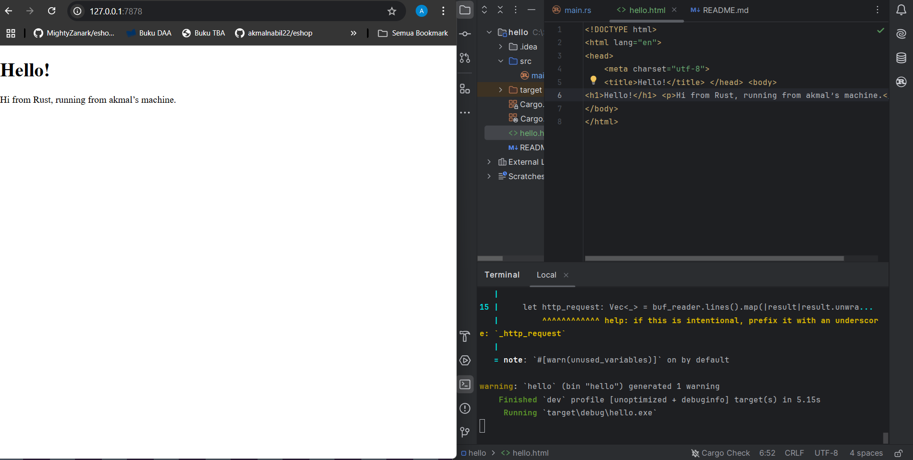
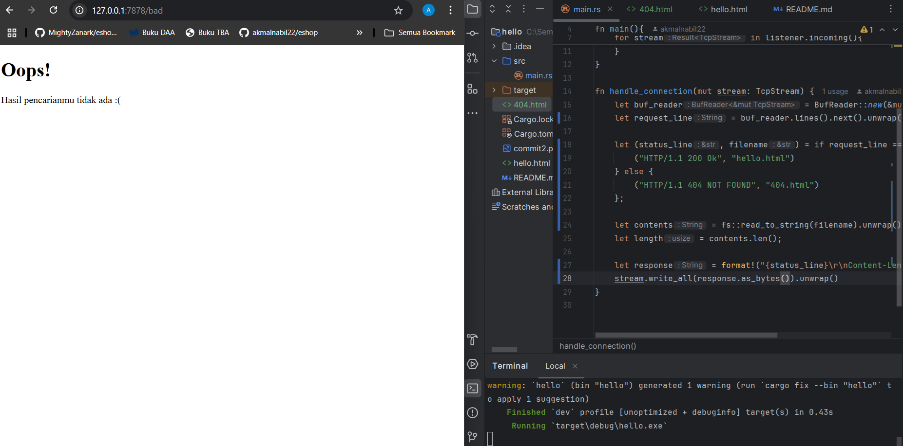

## Commit 1 Reflection

Fungsi `handle_connection` menerima sebuah request sebagai parameter. `BufReader` akan melakukan split untuk dilakukan iterasi
dan setiap line nya akan dimasukkan ke dalam vektor. Setiap item pada vektor kemudian akan dicetak.

## Commit 2 Reflection

fungsi `handle_connection` sekarang akan mengirimkan HTTP Response dengan status 200 Ok. Response juga akan mengirimkan 
file html yang akan ditampilkan pada web browser beserta panjang dari konten file html.

## Commit 3 Reflection

fungsi `handle_connection` sekarang akan menyesuaikan file html yang dikirim sesuai dengan status yang didapatkan dari request.
Jika status yang didapat `200 Ok`, akan mengirimkan `hello.html`. Jika status yang didapat `404 NOT FOUND`, maka file html yang
dikirim akan mengirimkan `404.html`. Refactoring dilakukan agar tidak ada duplikasi kode pada `main.rs`.